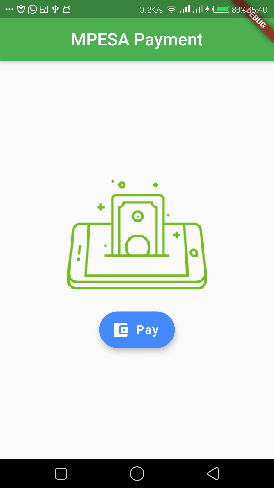

# MPESA WITH FLUTTER

This project entails integrating your flutter mobile apps with M-PESA.

## Getting Started

A few resources to get you started if this is your first Flutter project:

- [Lab: Write your first Flutter app](https://flutter.dev/docs/get-started/codelab)
- [Cookbook: Useful Flutter samples](https://flutter.dev/docs/cookbook)

For help getting started with Flutter, view our
[online documentation](https://flutter.dev/docs), which offers tutorials,
samples, guidance on mobile development, and a full API reference.


## Prerequisites:

### Credentials

1. Create an account on the [Safaricom Developer Portal](https://developer.safaricom.co.ke/)
2. Create a Lipa na MPESA Online App
3. Get your keys -> `ConsumerKey` and `ConsumerSecret`

### Usage

This requires good understanding of the MPESA C2B concept, in as much as it will help you complete the process,
you will also need to get things right in order to have it serve you right. With that said,

These two places will help you get started on a better gear.
1. [Safaricom API Tutorial ](http://peternjeru.co.ke/safdaraja/ui/#lnm_tutorial)
2. [Safaricom Developer Portal Docs](https://developer.safaricom.co.ke/docs)


From here, it's now simpler to have it on your app.

1. You will need to set the keys before initiating the payment.
```dart
    import 'package:mpesa_flutter_plugin/mpesa_flutter_plugin.dart';
    
    void main(){
    MpesaFlutterPlugin.setConsumerKey(<your-consumer-key>);
    MpesaFlutterPlugin.setConsumerSecret(<your-consumer-secret>);
    runApp(new MyApp());
    
    }
  ```
  
  2. Initiate the payment.
  ```dart

  dynamic transactionInitialisation;
 //Wrap it with a try-catch
  try {
  //Run it
  transactionInitialisation =
          await MpesaFlutterPlugin.initializeMpesaSTKPush(
                  businessShortCode: <your-code>,
                  transactionType: TransactionType.CustomerPayBillOnline,
                  amount: <amount-in-string-format>,
                  partyA: <user's-phone-to-request-payment>,
                  partyB: <your-code>,
                  callBackURL: <url-to-receive-payment-results>,
                  accountReference: <could-be-order-number>,
                  phoneNumber: <user's-phone-to-request-payment>,
                  baseUri: <live-or-sandbox-base-url>,
                  transactionDesc: <short-description>,
                  passKey: <your-passkey>);
                  
  } catch (e) {
  //you can implement your exception handling here.
  //Network unreachability is a sure exception.
  print(e.getMessage();
  }
  ```
  With that you are pretty much done. Here is a breakdown of the params required :
  
  1. `businessShortCode`  & `partyB` which you can apply from the developer portal mentioned in credentials, alternatively, use `174379` for test purposes.
  2. `amount` amount you expect from customer, in Ksh, string.
  3. `phoneNumber` & `partyA` the user's phone number to request payment from.
  4. `callBackURL` is where the payment results will be *POSTed* to you.
  5. `accountReference` what are the payments for? a short ref like users' order, account number...will be displayed to the user when requesting completion of payment.
  5. `transactionDesc` brief description of the tansaction. Not actually a description, a _descriptive_ word. (Sometimes optional)
  6. `passKey` obtained from portal, will be blended with a few more things to generate your final password later, alternatively, use `bfb279f9aa9bdbcf158e97dd71a467cd2e0c893059b10f78e6b72ada1ed2c919` for test purposes.
  
  ### Docs at a glance.
  When you place the request, and network does it's job well, the MPESA payment processor will validate your parameters and send your an acknowledgement or an error response immediately:
  case success: expect something of this sort in `transactionInitialisation` var.
  
  ```json
  {
      "MerchantRequestID": "1466 - 405147 - 1",
      "CheckoutRequestID" : "ws_CO_DMZ_370754209_06062019172849964",
      "ResponseCode" : "0",
      "ResponseDescription": "Success.Request accepted for processing",
      "CustomerMessage" : "Success.Request accepted for processing"
  }
  ```
  It means just that, accepted for processing, yet to be processed.
  
  else, if some of your params are not accepted, expect something of this sort:
  ```json
  {
      "requestId": "751-526141-1",
      "errorCode": "400.002.02",
      "errorMessage": "Bad Request - Invalid Amount"
  }
  ```
  After this, the payment processor will proceed to seek the user and hopefully find, hopefully accepts the payment by giving correct pin, and hopefully they have enough amount ...
  case success, expect something like this on your backend, where the `callBackURL` points to:
  ```json
  { "Body":
      { "stkCallback":
              { "MerchantRequestID": "1466-405147-1",
              "CheckoutRequestID": "ws_CO_DMZ_370754209_06062019172849964",
              "ResultCode": 0,
              "ResultDesc": "The service request is processed successfully.",
              "CallbackMetadata": {
                              "Item":
                                      [
                                          {
                                          "Name": "Amount",
                                          "Value": 100.00
                                          },
                                          
                                          {
                                          "Name": "MpesaReceiptNumber",
                                          "Value": "NF68F38A1G"
                                          },
                                          
                                          {
                                          "Name": "Balance"
                                          },
                                          
                                          {
                                          "Name": "TransactionDate",
                                          "Value": 20190606172857
                                          },
                                          
                                          {
                                          "Name": "PhoneNumber",
                                          "Value": 254710xxx574
                                          }
                                      ]
              
                          }

                }

        }

}
```
case failure of a transaction, this is a sample of your result:
```json
{
    "Body":
        {
        "stkCallback":
                {
                "MerchantRequestID":"24963-1092493-1",
                "CheckoutRequestID":"ws_CO_DMZ_511000437_07062019123449116",
                "ResultCode":2001,
                "ResultDesc":"[MpesaCB - ]The initiator information is invalid."

                }

        }

}
```

That's what in the docs in summary.

 ## Screenshots

<div style="text-align: center"><table><tr>
<td style="text-align: center">




</td>

<td style="text-align: center">


</td>

<td style="text-align: center">


</td>
</tr></table></div> 


## Contributing
Pull Requests are welcomed to this project on [GitHub](https://github.com/timndichu/mpesa-flutter-integration/).


